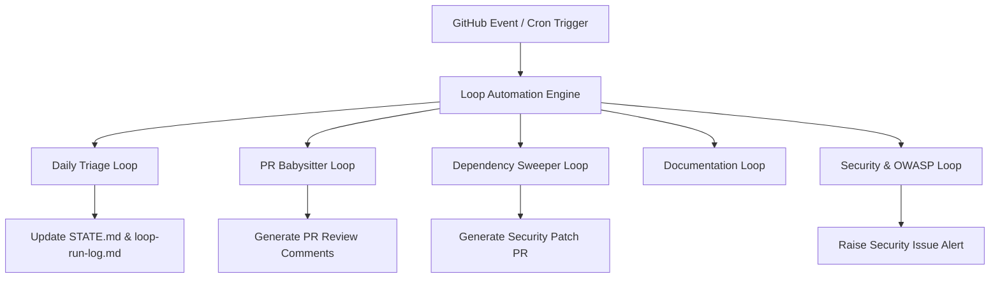

# Loop Engineering Ecosystem & Architecture
## Mini ERP + CRM Operations Portal

---

## 1. Executive Summary & Philosophy
**Loop Engineering** is an automated continuous engineering workflow framework integrated into the Mini ERP + CRM Operations Portal. The ecosystem systematically reviews code quality, enforces architectural patterns, runs security scans, validates database schemas, and maintains documentation without altering core business rules or automatically merging PRs.

---

## 2. Active Loops Specification

### 2.1 Daily Engineering Loop
- **Frequency**: Every 24 hours (Cron `0 2 * * *`).
- **Target**: Complete repository code analysis.
- **Tasks**: Inspect for TODO comments, dead code, missing input validation, N+1 query patterns, and audit log coverage.
- **Output**: Generates daily triage summary log and updates `STATE.md`.

### 2.2 PR Babysitter Loop
- **Frequency**: Triggered on every Pull Request submission.
- **Tasks**: Runs ESLint, Jest unit tests, Prisma schema validation, security header check, and bundle size audit.
- **Guardrail**: Never merges PRs automatically. Leaves structured review comments for human engineers.

### 2.3 Dependency Sweeper Loop
- **Frequency**: Weekly on Mondays (Cron `0 4 * * 1`).
- **Tasks**: Scans `package.json` for vulnerabilities via `npm audit` and checks for non-breaking patch updates.
- **Guardrail**: Never auto-updates major version releases.

### 2.4 Security & Audit Loop
- **Frequency**: Daily on code changes.
- **Tasks**: Scans JWT token rotation implementation, bcrypt salt rounds, Helmet headers, CORS origins, and SQL injection protections.

---

## 3. Loop Safety Constraints
All automated loops must adhere strictly to [loop-constraints.md](file:///c:/Users/SHILPA/Downloads/ERP-CRM/loop-constraints.md).
