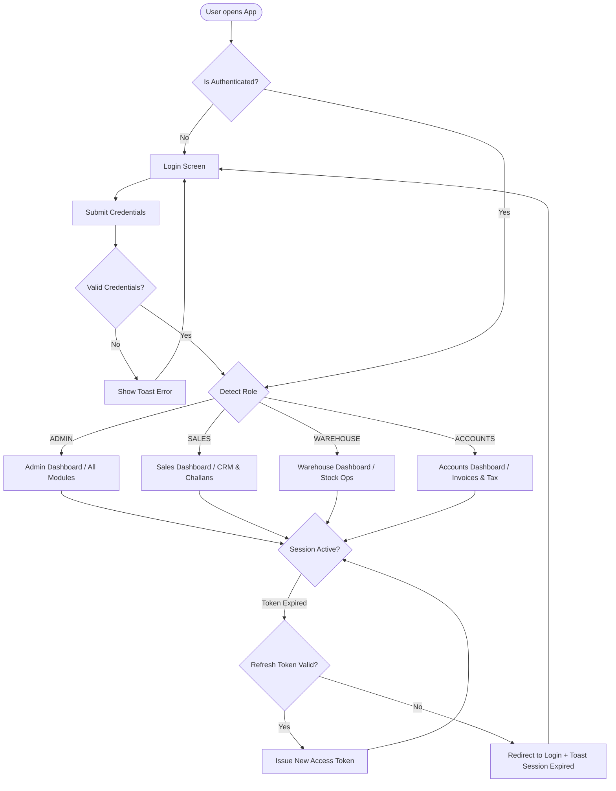
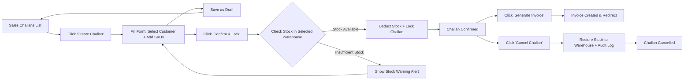
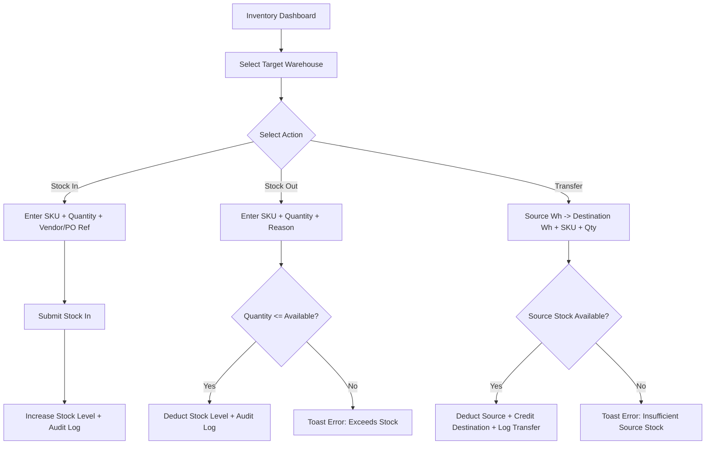

# App Flow & Navigation Architecture
## Mini ERP + CRM Operations Portal

---

## 1. Overview & Navigation Strategy
The **Mini ERP + CRM Operations Portal** provides an intuitive, role-aware navigation flow designed to maximize operational efficiency, minimize clicks, and ensure clear role separation across Admin, Sales, Warehouse, and Accounts staff.

---

## 2. Authentication & Session Routing Flow

---

## 3. Role Navigation Matrix

| Screen / Feature | Route Path | ADMIN | SALES | WAREHOUSE | ACCOUNTS |
| :--- | :--- | :---: | :---: | :---: | :---: |
| **Login** | `/login` | Public | Public | Public | Public |
| **Dashboard** | `/dashboard` | View | View | View | View |
| **Customer CRM** | `/customers` | Full | Full | Read | Read |
| **Customer Detail & Notes**| `/customers/:id` | Full | Full | Read | Read |
| **Product Master** | `/products` | Full | Read | Full | Read |
| **Warehouse Stock Ops** | `/inventory` | Full | Read | Full | Read |
| **Sales Challans** | `/challans` | Full | Full | Read | Read |
| **Create Challan** | `/challans/new` | Full | Full | None | None |
| **Invoices** | `/invoices` | Full | Read | None | Full |
| **CRM Follow-ups** | `/followups` | Full | Full | None | None |
| **Reports Portal** | `/reports` | Full | Read | Read | Full |
| **Audit Logs** | `/audit-logs` | Full | None | None | None |
| **System Settings** | `/settings` | Full | Read | Read | Read |

---

## 4. Module Navigation Diagrams

### Sales Challan Lifecycle Flow

### Stock Adjustment & Transfer Flow

---

## 5. Screen Inventory & UX Transitions

1. **Login Page (`/login`)**: Sleek dark card with logo, email/password inputs, role preview badge, and password toggle.
2. **Dashboard (`/dashboard`)**: Unified control center featuring 4 stats cards, 4 interactive charts, recent audit timeline, low stock alert widget, and quick-action shortcuts.
3. **Customers Page (`/customers`)**: Table listing with search bar, filter by lead status, pagination controls, "Add Customer" modal, export to CSV button.
4. **Customer Detail (`/customers/:id`)**: Dual-column layout: Left column contains contact details, billing/shipping address, GSTIN; Right column contains activity timeline and note logger.
5. **Products Page (`/products`)**: Grid view / Table view toggle, search SKU/Barcode/Name, stock status badges (`In Stock`, `Low Stock`, `Out of Stock`), image preview modal, Product Form modal with Cloudinary dropzone.
6. **Inventory Operations (`/inventory`)**: Warehouse tabs, stock table with quick stock-in/stock-out modal triggers, low-stock threshold alert section, stock movement audit trail.
7. **Sales Challan List (`/challans`)**: Status tab filters (`ALL`, `DRAFT`, `CONFIRMED`, `CANCELLED`), invoice generation trigger, Challan Detail drawer, print preview.
8. **Create Sales Challan (`/challans/new`)**: Multi-item line item builder with live product lookup, price calculation, real-time stock indicator per SKU, discount input, tax preview, draft/confirm buttons.
9. **Invoices (`/invoices`)**: Invoice register table with payment status indicators, printable tax invoice layout with company header, GST breakdowns, and download action.
10. **CRM Follow-ups (`/followups`)**: Filterable list for today's due calls, upcoming calls, and overdue follow-ups with instant completion modal.
11. **Reports Portal (`/reports`)**: Interactive filter bar for date ranges, multi-tab analytics (Sales, Stock Valuation, GST Summary), and instant CSV/PDF export.
12. **Audit Log Explorer (`/audit-logs`)**: Admin log reader with filters for module, action type, user, and date range.
