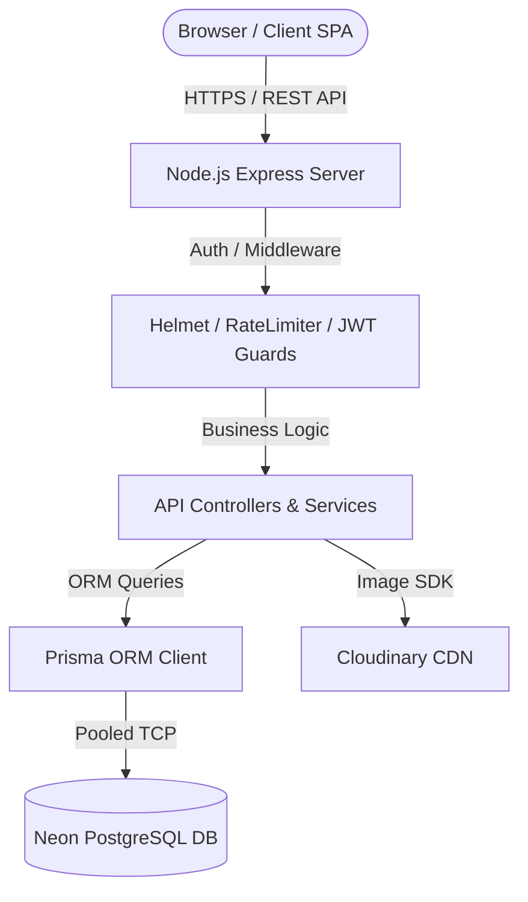
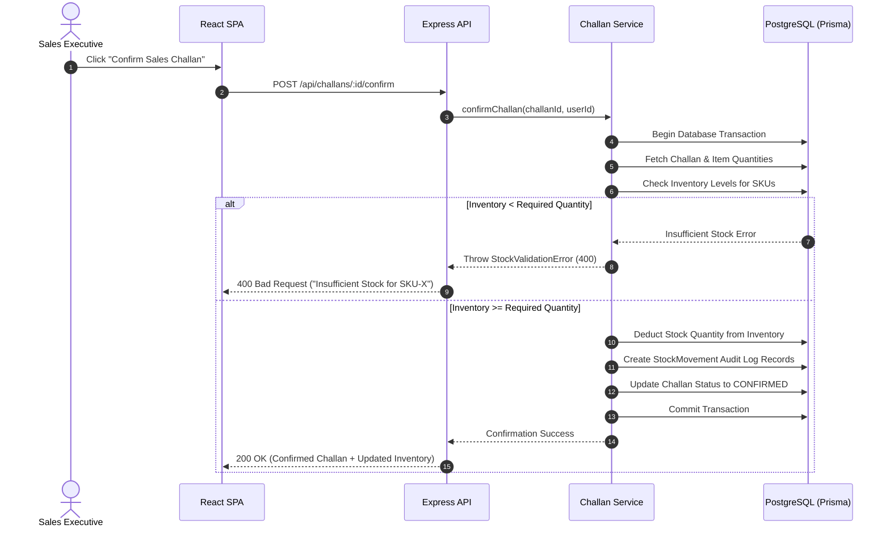
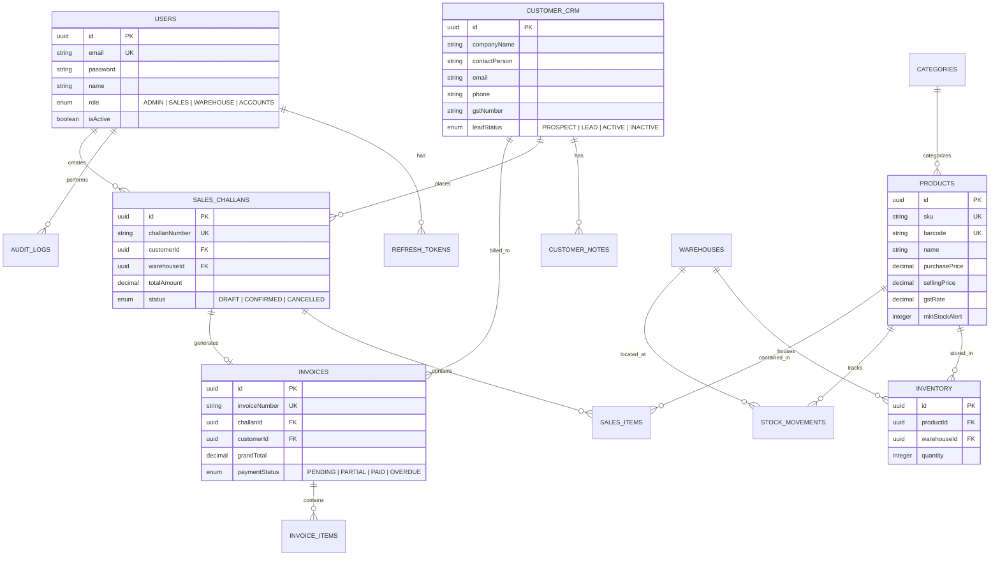

# Technical Requirements Document (TRD)
## Mini ERP + CRM Operations Portal

---

## 1. Document Information
- **Project Name**: Mini ERP + CRM Operations Portal
- **Version**: 1.0.0 Enterprise Production
- **Author**: Principal System Architect
- **Purpose**: Definitive technical specifications for architecture, engineering patterns, data flows, database schemas, APIs, security, and deployment pipelines.

---

## 2. System Overview & Architecture

### High-Level Architecture
The platform is built as a decoupled, multi-tier client-server architecture:
1. **Frontend Tier**: Single Page Application (SPA) built with React.js, Vite, Tailwind CSS, React Query, and Framer Motion.
2. **API Backend Tier**: Node.js REST API using Express.js, structured with Controller-Service-Repository pattern.
3. **Data Tier**: Managed PostgreSQL DB (Neon) accessed via Prisma ORM with connection pooling.
4. **Media Storage**: Cloudinary CDN for optimized image delivery.

### Key Technical Stack
- **Frontend**: React 18, Vite 5, Tailwind CSS 3, React Router 6, TanStack Query (React Query) v5, React Hook Form v7, Chart.js / react-chartjs-2, Lucide React, Framer Motion.
- **Backend**: Node.js v20+, Express.js v4, Prisma ORM v5, JWT (jsonwebtoken), bcryptjs, Winston, Express Validator, Helmet, CORS, Compression.
- **Database**: PostgreSQL 16 (Neon / Serverless DB).

---

## 3. Core Business Workflows & Data Flows

### Stock Allocation & Sales Challan Confirmation Flow

---

## 4. Database Schema Specifications

### PostgreSQL ER Model Diagram

---

## 5. Security & Non-Functional Specifications

1. **Input Validation**: Express-validator on all POST/PUT endpoints.
2. **Password Security**: Bcrypt with minimum cost factor 12.
3. **Data Protection**: SQL Injection protection via Prisma parameterized queries; XSS prevention via automatic JSX escaping and Helmet CSP headers.
4. **Rate Limiting**: API Rate Limiting set to 100 requests per 15 minutes per IP; Auth rate limiting set to 5 requests per 15 minutes.
5. **Session Expiry**: Access Token expires in 15 minutes; Refresh token stored in HTTP-Only secure cookie expires in 7 days.
